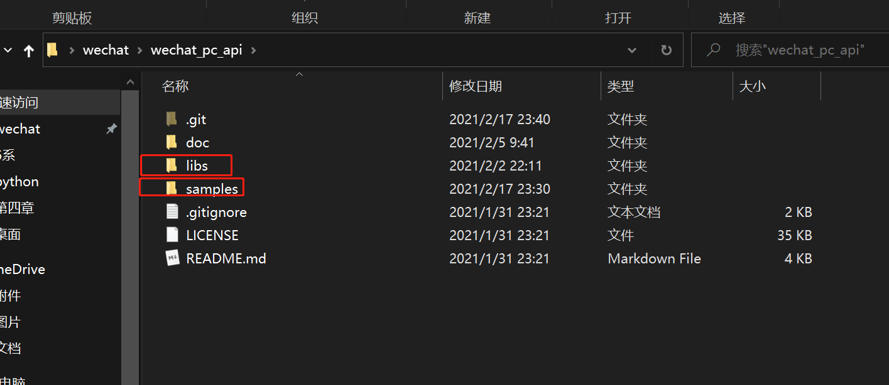
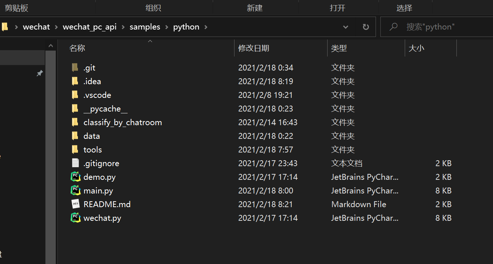

请大家仔细看明白，在已有的代码基础上写。

# 注意文件的相对路径关系（重要！否则可能执行出错）

libs和samples是同一个目录下的。（libs文件夹大家都电脑都有，我就没必要再上传了）

以下是我push到github上的文件。

# 文件含义

## `demo.py`

github原项目上最原始的版本

## `main.py`

我们一般运行程序的入口！！

## `wechat.py`

github原项目上提供的方法模块

## data文件夹

### `chatrooms.txt`

个人的群信息的统计

### `friends.txt`

个人的朋友的信息统计

### `jilu.txt`

wlc除夕那一天所接受到的所有消息（每行是一条信息）

### `log.txt`

每次运行main.py时会将数据写到次文件里。

### `macros`

微信所有宏定义表情的集合。用于分词。

## tools文件夹

### `classify.py`

实现对消息的分拣。

另外，根目录下的`classify_by_chatroom`就是通过此py文件生成的。

### `delete_flie.py`

实现支持正则表达式的文件删除。（被`classify.py`import）

### `get_chatrooms.py`

输出用户的所有群的统计信息

### `get_friends.py`

输出用户的所有好友的统计消息

### `message.py`

wlc写的一个消息的类。**建议大家都在这个基础上写**。

